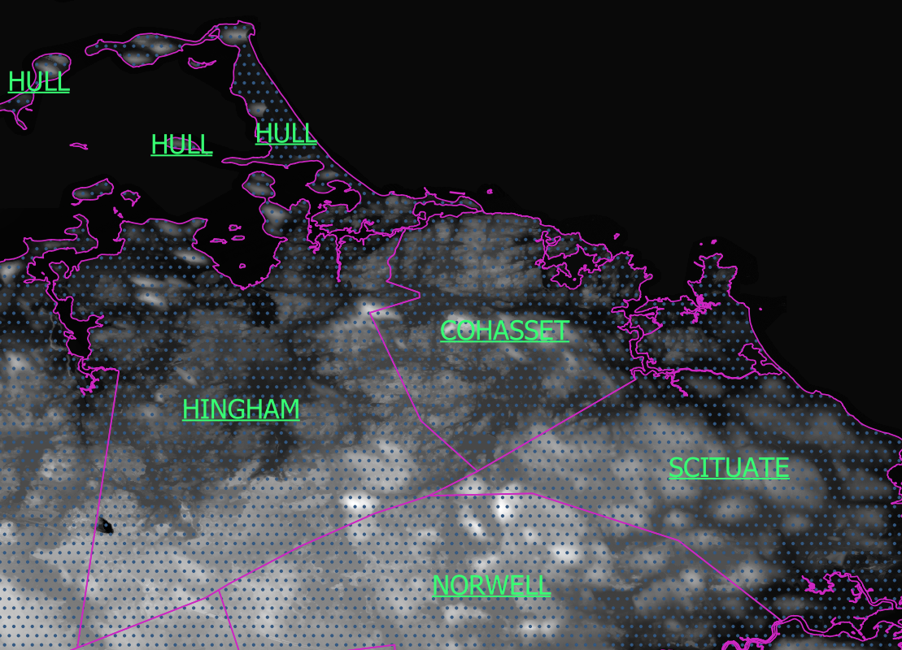

# South_Shore_Heighmap_data
Heightmap repository of geographic regions located on the South Shore of Massachusetts.

(Map_clip_final is the reduced file)

**1/9th arc second archive downlaods can be found in geo_data.txt.**

## Specifications of combined map.

Uncompressed Download Link : https://drive.google.com/file/d/1amzVd9LH2UYglNhSfulxIw3B_1blrnsX/view?usp=sharing

- Map is aproximately 45km by 55km in size
- Maximum height value of 83 meters, minimum of -31 meters
- Might have used the wrong projection so some places may look funky
